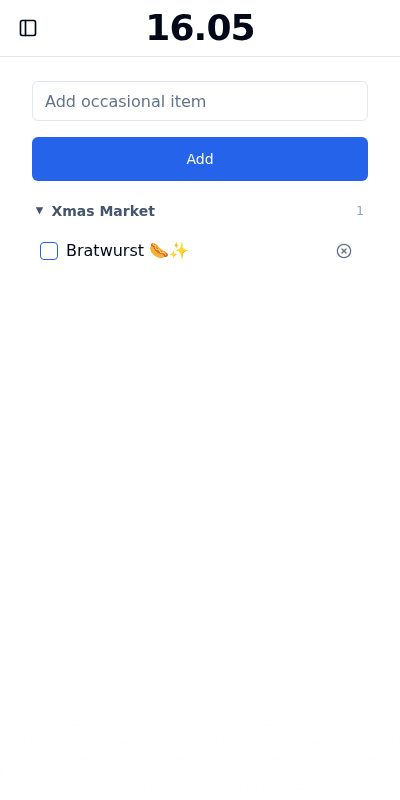

# Checked

Minimalistic grocery list app with focus on frequently used everyday products.

> The app is in its pr
e-pre-alpha stage. You can try it at https://checked-95k.pages.dev/. Please, remember
that the demo version uses public automerge sync server and the data can be erased at any time.

Forked from original project https://github.com/nonscalable/OnlyGroceries

## Goals

- Minimalistic app with clear functionality.
- Local-first. The app works even if there is no internet connectivity.

## Concept

### Main Page

The `Shopping List` page is the focus of the application.  Items can be added to the shopping list by entering them into the text box.  An item from the `Staples` list or a user added list in the `Special` section of the sidebar.

Items can be added, edited, removed, rearranged, or moved to a different list within each of the lists.  Items added to the `Shopping List` that are not included in other lists can be moved to a list at any time from the `Shopping List`.

This makes the following workflow:

1. You add your regular items to the list.
2. Before going to the shop, you click on the item you're going to buy.
3. Once you're in the shop, switch to `Shopping List` tab to see only the items you need. No distractions!
4. The `Shopping List` will show all items added from across all your lists and provide them in foldable sections for organziation.

### Special lists

Multiple lists can be managed from the side bar.  The lists can be reorganized by dragging and dropping.  Any items from the special lists can be added to the shopping list in the same way as possible from the `Staples` list. 

### Settings Page

Light and Dark mode are available along with personalized color highlighting for themes.

Create multiple lists and easily switch between them.

Export a backup of your list id's to import within another browser or share with another user.  Every list in your browser will be exported.  If you dont want to share every list with someone, use the Copy/Share button to share a single list.

## Self Hosting

It's recommended to install this using the docker-compose.yaml

There is no security built in to the application.  It is recommended you use something like Cloudflare Access or Tailscale to access your Checked list when away.
