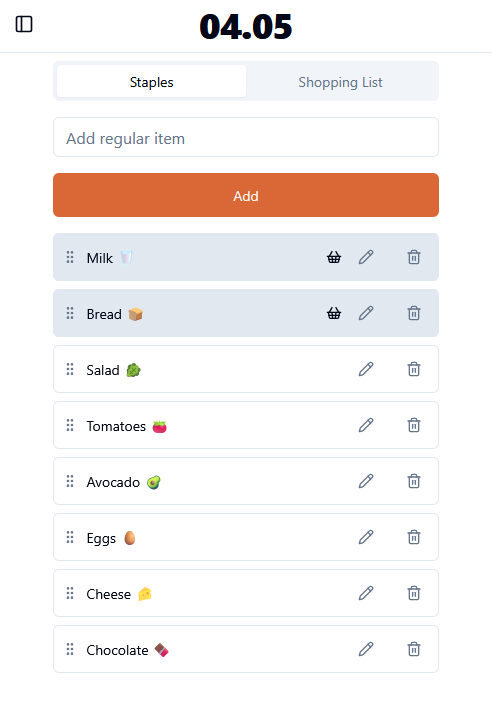
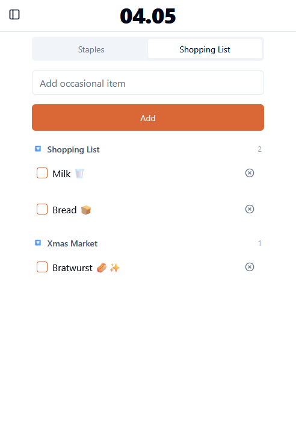
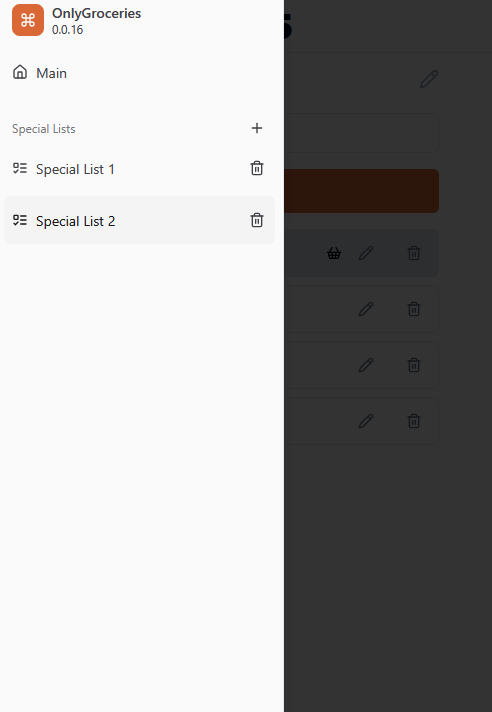
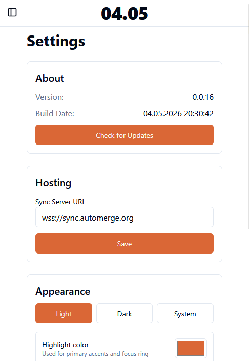
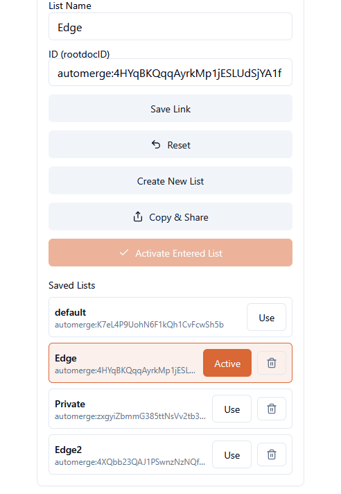

# Only Groceries

Minimalistic grocery list app with focus on frequently used everyday products.

|              At home              |            In the shop                 |            Sidebar                 |            Settings                 |            Settings                 |
| ----------------------------------- | ----------------------------------- | ----------------------------------- | ----------------------------------- | ----------------------------------- |
|  |  |  |  |  |

> The app is in its pr
e-pre-alpha stage. You can try it at [`https://onlygroceries-br5.pages.dev/`](https://onlygroceries-br5.pages.dev/). Please, remember
that the demo version uses public automerge sync server and the data can be erased at any time.

The application in this fork has a superset of features not found upstream and the link above will not accurately depict what is now possible.

## Goals

- Minimalistic app with clear functionality.
- Local-first. The app works even if there is no internet connectivity.

## Concept

### Main Page

The main page consists of two tabs: `Staples` and `Shopping List`.

The `Staples` keep the list of your everyday products e.g. bread, milk, anything. Here you can:

- Manage regular products list: add, remove or re-arrange products.
- Add products to the `Shopping List` by clicking on them.

The `Shopping List` contains the products you're going to buy next time.

This makes the following workflow:

1. You add your regular items to the list.
2. Before going to the shop, you click on the item you're going to buy.
3. Once you're in the shop, switch to `Shopping List` tab to see only the items you need. No distractions!
4. The `Shopping List` will show all items added from across all your lists and provide them in foldable sections for organziation.

### Special lists

Multiple lists can be managed from the side bar.  The lists can be reorganized by dragging and dropping.  Any items from the special lists can be added to the shopping list in the same way as possible from the `Staples` list. 

### Settings Page

Light and Dark mode are available along with personalized color highlighting for themes.

Create multiple lists and easily switch between them.

Export a backup of your list id's to import within another browser.

## Self Hosting

It's recommended to install this using the docker-compose.yaml

There is no security built in to the application.  It is recommended you use something like Cloudflare Access or Tailscale to access your OnlyGroceries list when away.
